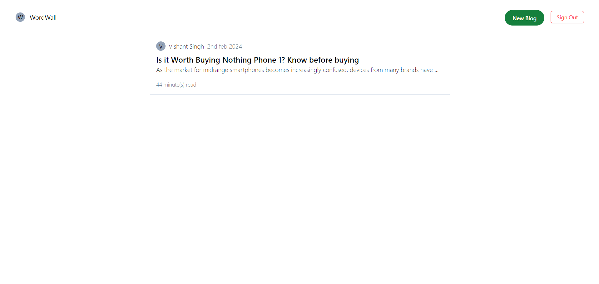

# WordWall

Welcome to WordWall! This platform is designed to provide users with a seamless experience for creating, publishing, and exploring blogs on various topics. Whether you're a writer looking to share your insights or a reader searching for engaging content, our platform aims to cater to your needs.

# Snapshots
- **Signup** .png)
- **Dashboard** 

## Features

- **Secure Authentication:** Utilizes JSON Web Tokens (JWT) for secure authentication, ensuring user data remains protected.
  
- **Centralized Blog Hub:** Provides a centralized hub for users to explore a diverse range of blogs, fostering a vibrant community of knowledge-sharing and discussion.

- **Effortless Content Creation:** Empowers users with an intuitive interface for creating and publishing blogs seamlessly.

## Tech Stack

- **Frontend:** HTML, CSS, TypeScript, React.js - Deployed on Vercel
  
- **Backend:** TypeScript, Hono - Deployed with Cloudflare 
- **ORM** : Prisma
  
- **Database:** PostgresSQL

## Getting Started

To clone and run this project locally, follow these steps:

1. **Clone the repository:**

    ```bash
    git clone <repository_url.git>
    ```

2. **Navigate to the project directory:**

    ```bash
    cd wordwall
    ```

3. **Install dependencies:**

    ```bash
    npm install
    ```

4. **Set up your environment variables:**

    - Create a `.env` file in the root directory.
    - Add necessary environment variables (e.g., database connection URI, JWT secret, Prisma accelerate API Key).

5. **Start the development server:**

    ```bash
    npm run dev
    ```

6. **Visit [http://localhost:3000](http://localhost:3000) in your browser to view the website.**
